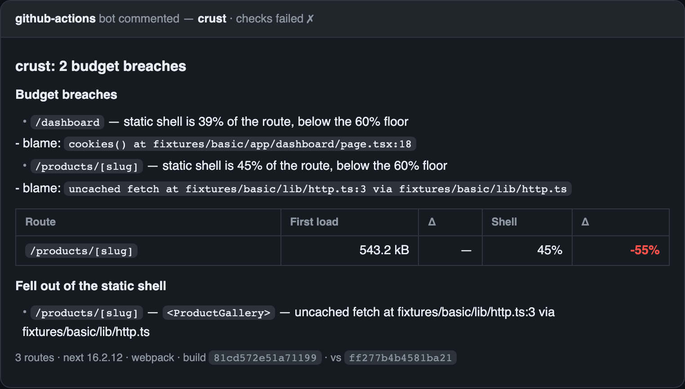

# crust

> The crust is what ships instantly. `crust` tells you what's in it, what fell out, and when.

A performance analyzer for Next.js App Router projects. It builds a static map of your project from
source, joins it to runtime measurements, and stores snapshots over time — so a regression traces
back to the commit and the import that caused it.



No build error was produced and no bundle grew — a `use cache` directive was removed three call
frames below the page, and 55% of the route silently stopped being static. This comment is the
only place that failure is visible.

**Status: pre-alpha.** Nothing here is stable yet.

## What it does

1. **Analyzer** — route table, bundle sizes, server/client boundary graph, dynamic-route reasons.
2. **History + diff** — a snapshot per build, per-route deltas with the module responsible.
3. **Shell engine** — predicted vs. actual static shell per route, and what broke it.
4. **Widget** — in-page route map, streaming waterfall, image audit, live vitals.

The thing nothing else does: route-level regression blame *and* shell composition, together.
`@next/bundle-analyzer` has no history. Speed Insights has no source attribution. size-limit tools
don't understand routes or RSC boundaries. Next's build output tells you a route is partially
prerendered, but not why your shell shrank.

## Usage

crust reads the output of a **production build**. Run one first — it refuses to measure
`next dev`, because dev numbers are unminified, unbundled and HMR-laden.

```bash
next build
npx crust analyze
```

```
crust cfdcf50068722687  next 16.2.12 · webpack · 3 routes

Route              First load   Shell  Mode
/                    543.2 kB    100%  static
/dashboard           527.4 kB     39%  partial
                    ↳ cookies() at app/dashboard/page.tsx:18
                    ✂ <Theme> — cookies() at app/dashboard/page.tsx:18
/products/[slug]     543.2 kB    100%  partial
```

Then, after a change:

```bash
next build
npx crust diff main
```

```
crust diff  cfdcf50068722687 -> 4a80239769ea8b93

/products/[slug]  543.2 kB  +0.0 kB
    shell 100% -> 45%
    ✂ <ProductGallery> left the shell — uncached fetch at lib/http.ts:3
```

That last line is the point. No build error was produced, no bundle grew — a `use cache`
directive was removed three call frames below the page, and 55% of the route stopped being
static. Nothing else surfaces that.

### Module attribution needs source maps

Route totals and shell analysis work out of the box. Blaming a specific *file* for those bytes
needs source maps in the production build:

```ts
// next.config.ts
export default { productionBrowserSourceMaps: true }
```

Without it crust still reports route sizes and shell composition, and says plainly that
attribution is unavailable rather than guessing. Turn it on in a dedicated analyze build if you
don't want maps in production.

### Seeing it visually

A self-contained HTML report — no integration, no server, one file you can open or attach to a PR:

```bash
npx crust report --open
```

Or run it **inside your app** as a floating panel. Write the manifest where the app can fetch it,
then mount the widget:

```bash
npx crust manifest --out public/crust-manifest.json
```

```tsx
// components/CrustDevtools.tsx
'use client'

import { useEffect } from 'react'

export function CrustDevtools() {
  useEffect(() => {
    if (!process.env.NEXT_PUBLIC_CRUST) return
    let dispose: (() => void) | undefined
    import('crust/widget').then((m) => {
      dispose = m.mountCrustWidget()
    })
    return () => dispose?.()
  }, [])

  return null
}
```

Render `<CrustDevtools />` in your root layout and build with the gate on:

```bash
NEXT_PUBLIC_CRUST=1 next build
```

The gate is checked before the dynamic `import()`, so with the variable unset the bundler drops the
widget entirely — it is never in your production bundle. The panel renders in a shadow root, so it
cannot restyle your app and your CSS cannot break it, and the manifest is only fetched when you
first open it, so it does not move the numbers it is reporting.

**The manifest lists every route, source path and component name in your app.** Generate it in
analyze builds only, never in the build you deploy.

### CI

```bash
npx crust ci main --comment comment.md
```

Exits non-zero on a budget breach and writes a PR comment. Budgets live in `.perf/budgets.json`:

```json
{
  "defaultFirstLoadBytes": 250000,
  "firstLoadBytes": { "/products/[slug]": 180000 },
  "maxGrowth": 0.05,
  "defaultMinShellRatio": 0.6
}
```

Both axes are covered on purpose: a check that only guards bytes will happily pass a PR that
silently halved your static shell.

Snapshots live in `.perf/` (one file per build — no merge conflicts) and sync through an orphan
`perf-history` branch so a fresh CI checkout has a baseline:

```bash
npx crust history fetch
npx crust history push
```

The bundled GitHub Action ([action/action.yml](action/action.yml)) does both, posts the comment,
and updates it in place on every push. Fork PRs get the comment but skip the push — their token is
read-only on the base repo, by design. `npx crust prune` applies the retention ladder: the newest
50 builds at full fidelity, then one per commit, then module detail dropped after 90 days; route
totals and shell ratios are kept forever.

### Runtime measurement

The collector observes real visits — Web Vitals via `PerformanceObserver`, long animation frames,
an image audit, and the streaming waterfall (when each Suspense hole actually filled):

```tsx
import { startCollector } from 'crust/collector'

startCollector() // behind the same NEXT_PUBLIC_CRUST gate as the widget
```

The widget shows the live values for the current page. The streaming view sits behind a capability
check and reports "unavailable on this Next version" rather than breaking when internals move.

On staging, beacon samples to a write-only, authenticated, rate-limited endpoint:

```ts
// app/api/__crust/ingest/route.ts
import { createIngestHandler } from 'crust/ingest'

export const POST = createIngestHandler({ secret: process.env.CRUST_INGEST_SECRET! })
```

And measure synthetically with pinned throttling (needs Playwright, an optional peer):

```bash
npx crust synthetic https://staging.example.com / /products/1 --cpu 4 --network fast-3g
```

The first iteration is discarded (cold start), the median is reported, and runs on different
machines are never merged into one trend line. Staging numbers are labeled "vs. previous build" —
never "is this fast" — because a seeded staging database is a fraction of production's size.

### Server spans

Minimal by design — most teams' APM already covers this. `crust/otel` exports a span processor
that plugs into `instrumentation.ts` (a supported API; crust never patches server internals) and
aggregates render and fetch time by route:

```ts
import { registerOTel } from '@vercel/otel'
import { CrustSpanAggregator } from 'crust/otel'

export function register() {
  registerOTel({ serviceName: 'my-app', spanProcessors: [new CrustSpanAggregator()] })
}
```

## Escape hatches

Two optional JSON files in `.perf/`, for the tail the analyzer cannot resolve:

- `aliases.json` — `{ "app/old/page.tsx": "app/new/page.tsx" }` stitches a moved route back onto
  its history.
- `overrides.json` — `{ "@weird/alias": "packages/ui/src/index.ts" }` answers import specifiers no
  resolver can settle.

## Non-goals

These are permanent. They are written here before the first user arrives, on purpose.

- **Not a runtime APM.** No error tracking, no distributed tracing, no alerting.
- **Not a Lighthouse or PageSpeed replacement.**
- **Not multi-framework.** Next.js App Router only. Pages Router is detect-and-warn.
- **Not a hosted service.** No accounts, no SaaS dashboard.
- **Not a bundler.** It reads build output; it never changes how your app builds in production.
- **No config file** until three separate people request the same option. Zero-config is a feature,
  and config surface is permanent API you cannot remove.

## Locked decisions

| Decision | Choice | Why |
|---|---|---|
| Measurement target | Production builds only | Dev numbers are unminified, unbundled, HMR-laden fiction |
| Dev mode | Static map only, never timings | Better to show nothing than wrong numbers |
| Supported range | Two Next majors, both bundlers | Fail loudly outside it rather than emit wrong output |
| Package shape | One package, subpath exports | `/plugin`, `/ci`, later `/widget`, `/collector` |
| Snapshot store | One file per record + derived SQLite index | Per-file avoids git conflicts; the index is rebuildable |
| Prod safety | Build-time env gate, never a runtime flag | A runtime `if` still ships the code and the manifest |
| Unknowns | Report `unknown`, never guess | A predictor that guesses wrong destroys trust in the whole tool |

## Support

Next.js 15 and 16, webpack and Turbopack. Outside that range the tool refuses to run rather than
emit numbers it can't stand behind. Best-effort maintenance; issues triaged weekly.

## License

MIT.
