<p align="center">
  <a href="https://crust.moumen.dev/">
    <picture>
      <source media="(prefers-color-scheme: dark)" srcset="./docs/logo/dark.svg">
      <source media="(prefers-color-scheme: light)" srcset="./docs/logo/light.svg">
      
    </picture>
  </a>
</p>

<h1 align="center">crust</h1>

<p align="center">
  <strong>The production-build diff for Next.js.</strong>
  <br>
  Compare two App Router builds, understand what changed and why, and decide what can ship.
</p>

<p align="center">
  <a href="https://docs.crust.moumen.dev/docs/quickstart">Quickstart</a> ·
  <a href="https://docs.crust.moumen.dev/">Documentation</a> ·
  <a href="https://crust.moumen.dev/">Website</a> ·
  <a href="https://github.com/moumen-soliman/crust/issues/new">Feedback</a>
</p>

<p align="center">
  <a href="https://www.npmjs.com/package/@moumensoliman/crust"></a>
  <a href="https://github.com/moumen-soliman/crust/actions/workflows/ci.yml"></a>
  <a href="LICENSE"></a>
  
</p>

> **Pre-alpha:** the snapshot format, CLI output, and package API can still change.

## See the build diff before you merge

```bash
next build
npx @moumensoliman/crust diff main
```

```text
CRUST / DIFF  cfdcf50068722687 (main@cfdcf500) → 4a80239769ea8b93 (feature@4a802397)
10 changed  ·  9 regressions  ·  1 improvement  ·  attribution 94%

DECISION  BLOCK
`/products/[slug]` is no longer static, +8 more

CHANGES
✗ /products/[slug]  no longer static  ·  static shell 100% → 45%  ·  +48.2 kB
    lib/http.ts:3 in <ProductGallery>
    → Cache that read (`use cache`, or `fetch(…, { next: { revalidate } })`) and the route can prerender again.

✓ /account  -28.0 kB

CAUSES
  +48.2 kB  date-fns added  ·  package
             /products/[slug], /checkout, /analytics, +6 more  (9 routes)
             → Check whether `date-fns` needs to be in the client bundle - a server component or a `next/dynamic` import removes it from first load.
```

crust leads with the answer, not a route inventory:

- **Decision:** `BLOCK`, `REVIEW`, `CLEAR`, or `CANNOT DECIDE`
- **Changes:** regressions and improvements, with the strongest source location and likely action
- **Causes:** packages, client boundaries, barrels, and call sites grouped once with their blast radius
- **Coverage:** how much of the client JavaScript was attributed, shown beside the verdict

This is not a report about one bundle. It is a comparison of two production-build snapshots. With
two refs, both sides come from the store and neither build needs to be checked out or rebuilt:

```bash
crust diff v1.2.0 release/next
```

No snapshots yet? `--build` records both tips first, each in its own detached git worktree, without
moving your checkout - so it works from a dirty working tree on a third branch:

```bash
crust diff develop feature --build
```

## What crust catches

- A route moved from static to ISR, partial, or dynamic.
- A cached read became uncached.
- A component left the static shell.
- First-load JavaScript grew, including the module or package responsible.
- A `'use client'` boundary pulled a larger subtree into the browser.
- A barrel import dragged additional modules onto one or many routes.
- Build or route configuration changed in a way that explains the movement.
- A refactor worked: improvements are shown alongside regressions.

One cause is reported once. If a provider, package, barrel, or call site affects nine routes, crust
shows one decision with nine-route blast radius instead of nine copies of the same finding.

## Quickstart

### Requirements

- Next.js 15 or 16
- App Router
- webpack or Turbopack
- Node.js 20+
- A completed production build

Hybrid projects are supported, but Pages Router routes are not measured. Outside the supported
Next.js range, crust refuses to run instead of interpreting unverified build artifacts.

### Install

```bash
npm install --save-dev @moumensoliman/crust
# or
pnpm add --save-dev @moumensoliman/crust
```

The npm package is `@moumensoliman/crust`; the installed executable is `crust`. The unscoped
`crust` package is unrelated.

### Initialize

```bash
next build
npx @moumensoliman/crust init
```

`init` finds the app, records the first snapshot, writes explained starter budgets, and generates CI
configuration pinned to the crust version that created it. It does not replace files without
`--force`; use `--dry-run` to inspect the plan first.

In a monorepo, point it at the app:

```bash
npx @moumensoliman/crust init --cwd apps/web
```

Or use the commands directly:

```bash
# Explain the current production build and save its snapshot
npx @moumensoliman/crust analyze

# Compare the current .next build with main at its merge base
npx @moumensoliman/crust diff main

# Compare two snapshots already in the store
npx @moumensoliman/crust diff v1.2.0 release/next

# Build both tips in temporary worktrees, then compare them
npx @moumensoliman/crust diff develop feature --build
```

`analyze --routes` adds the complete route inventory. `analyze --verbose` expands coverage and
unresolved evidence. `analyze --report` writes the HTML report.

## Use it as a merge gate

`crust ci` applies the same comparison contract as `crust diff`, writes an updating PR comment, and
exits non-zero on blocking findings:

```bash
npx @moumensoliman/crust ci main --comment comment.md
```

Without a budget file, a comparable baseline is enough to block:

- a rendering-mode downgrade
- a newly uncached read
- disappearance of a previously emitted static shell

Project-specific limits stay explicit in `.perf/budgets.json`:

```json
{
  "defaultFirstLoadBytes": 250000,
  "firstLoadBytes": {
    "/products/[slug]": 180000
  },
  "maxGrowth": 0.05,
  "defaultMinShellRatio": 0.6,
  "allowRegression": ["/admin/[...slug]"]
}
```

Absolute ceilings still run when no comparable baseline exists because they describe the current
build. A newly added route is not treated as a regression, and `unknown` evidence is never assigned
a direction.

### GitHub Action

`.github/workflows/crust.yml`:

```yaml
name: crust

on:
  pull_request:
  push:
    branches: [main]

permissions:
  contents: write
  pull-requests: write

jobs:
  crust:
    runs-on: ubuntu-latest
    steps:
      - uses: actions/checkout@v4
      - uses: actions/setup-node@v4
        with:
          node-version: 22
      - run: npm ci
      - run: npx next build
      - uses: moumen-soliman/crust/action@master
        with:
          baseline: main
          crust-version: 0.2.0
```

The action fetches history, runs the check, publishes the current snapshot, and updates one PR
comment. Run it on the base branch as well as pull requests so future branches have a merge-base
snapshot.

See the [CI guide](https://docs.crust.moumen.dev/docs/guides/ci) for permissions, monorepos,
fork behavior, and the complete workflow.

### Measure trust instead of claiming it

Every blocking CI breach is appended to `.perf/findings.jsonl`. Mark whether authors agreed that it
was a real regression:

```bash
crust findings list --open
crust findings agree <id>
crust findings dispute <id> --note "why"
crust findings rate
```

The reported rate is `disputed / (agreed + disputed)`. Open findings do not enter the denominator,
and an empty log remains unmeasured rather than appearing as 0%.

## Evidence, not guesses

crust joins two kinds of evidence:

- **Production artifacts provide the what:** route and prerender manifests, client-reference and
  build manifests, resolved Next.js configuration, emitted HTML, JavaScript chunks, and source maps.
- **Application source provides the why:** pages, layouts, rendered components, imports and exports,
  Suspense and client boundaries, route configuration, dynamic APIs, fetch caching, and `'use cache'`.

It follows reachable functions and imported bindings from a route to the dynamic read or attributed
module. Direct relationships can be narrowed per function. Computed calls, unresolved aliases,
namespace imports, and other ambiguous paths remain conservative or `unknown`.

Every conclusion is labeled **verified**, **inferred**, or **unknown**. crust does not turn an
incomplete chain into confident blame.

### Compatibility gate

Route deltas are enforced only when snapshots have compatible:

- snapshot schemas
- bundlers
- Next.js major versions

If the builds cannot be compared safely, crust explains why and withholds enforceable deltas.
Configured absolute ceilings can still block because they require only the current build.

Routes are matched by their page-file identity rather than URL pattern, so URL refactors retain
history. `.perf/aliases.json` can stitch history across page-file moves.

### Source maps and attribution

Route totals, rendering modes, caching, and shell analysis work without browser source maps. Tracing
client bytes to files, packages, client boundaries, and barrels requires:

```ts
// next.config.ts
export default {
  productionBrowserSourceMaps: true,
}
```

Without maps, crust keeps the route totals, reports attribution as unavailable, and does not invent
a cause. Use a dedicated analysis build if you do not want to deploy browser source maps.

## How it works

```text
application source + production .next build
                    │
                    ▼
        route, shell, cache, and byte analysis
                    │
                    ▼
             comparable snapshot
                    │
       base snapshot ─── head snapshot
                    │
                    ▼
        decision + changes + grouped causes
                    │
           ┌────────┴────────┐
           ▼                 ▼
       terminal          PR comment
```

Snapshots live in `.perf/` as one file per build and can synchronize through an orphan
`perf-history` branch. Git state, lockfile, Next.js version, Node major, bundler, and resolved config
participate in build identity so unrelated environments are not merged into one trend.

The two snapshots a comparison needs usually arrive over time - each `analyze` or `ci` run records
one. `crust diff <base> <head> --build` fills both at once instead: it builds each tip in a detached
git worktree, writes the snapshots into that same `.perf/`, and skips any tip already measured. A
build or analysis that fails names the ref it failed on rather than comparing one side against an
older snapshot.

<details>
<summary>View the detailed architecture diagram</summary>

<p align="center">
  
</p>

</details>

## HTML report

```bash
npx @moumensoliman/crust report --open
```

The report is one self-contained file with no service or external requests. Search routes,
components, and source files; filter and group routes; expand complete cause chains; and inspect
shared-cause blast radius.

## Compared with Next.js Bundle Analyzer

Next.js bundle analyzers are the better tools for exploring the client and server module graph of
one build. They answer **“what is in this bundle?”**

crust complements them by recording compatible production builds and answering **“what changed
since the baseline, why did it change, everything affected, and should this merge?”** It compares
rendering modes, cache decisions, static-shell composition, client JavaScript, and configuration—not
only bundle contents.

## Command map

- `crust init` — guided setup, first snapshot, starter budgets, and CI configuration
- `crust analyze` — explain the current build and save a snapshot
- `crust diff [base] [head]` — compare the current build or any two stored refs; `--build` records
  both refs first, in temporary worktrees
- `crust ci [ref]` — enforce regressions and budgets; optionally write a PR comment
- `crust findings list|agree|dispute|rate` — review and score blocking findings
- `crust report` — generate a self-contained HTML report
- `crust history fetch|push` — synchronize snapshots with `perf-history`
- `crust list` — list saved snapshots
- `crust prune` — apply snapshot retention

Every build command accepts `--cwd <dir>` for monorepos and `--dist-dir <dir>` for a custom Next.js
output directory. See the [CLI reference](https://docs.crust.moumen.dev/docs/reference/cli) for all
flags and secondary commands.

## Optional runtime tooling

The merge decision needs only source code and a production build. The in-app panel, Web Vitals and
streaming collector, authenticated staging ingest, synthetic runner, and OpenTelemetry span
aggregator are optional and deliberately secondary:

- [In-app panel](https://docs.crust.moumen.dev/docs/guides/widget)
- [Runtime measurement](https://docs.crust.moumen.dev/docs/guides/runtime)
- [Staging and synthetic runs](https://docs.crust.moumen.dev/docs/guides/staging)

## Non-goals

- **Not a runtime APM:** no error tracking, distributed tracing platform, or alerting service.
- **Not a composite score:** every result stays tied to measurable build or runtime evidence.
- **Not multi-framework:** Next.js App Router only; Pages Router is detect-and-warn.
- **Not a hosted service:** no account or SaaS dashboard.
- **Not a bundler:** crust reads build output and never changes how the application is bundled.

## Support

Next.js 15 and 16, webpack and Turbopack, on Node.js 20 or newer. Outside that range crust refuses
to run rather than emit numbers it cannot support.

## Development

```bash
pnpm install
pnpm build
pnpm typecheck
pnpm test
```

The real-build tests use the apps under `fixtures/`; build output is intentionally not committed.
The Phase 0 webpack and Turbopack attribution results are in
[`docs/phase-0-findings.md`](docs/phase-0-findings.md).

## License

[MIT](LICENSE) © Moumen Soliman.
